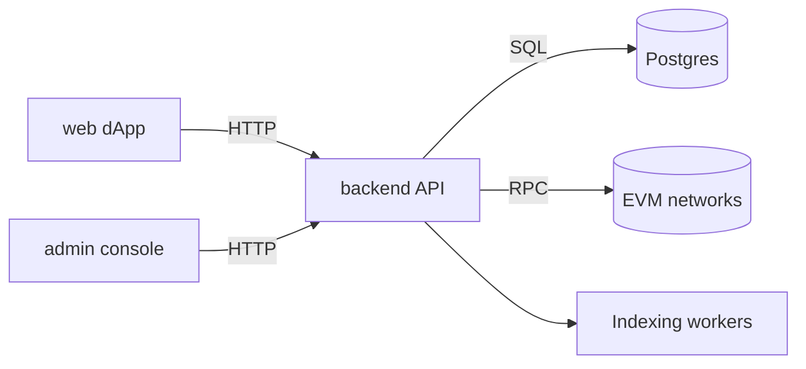

# Achievo Monorepo

Achievo is a monorepo for smart contracts, a NestJS API, and Next.js apps that coordinate on-chain org registries, verifiable proofs, and user-facing credential workflows.

## Architecture



## Monorepo layout

- `web/` – public dApp (Next.js)
- `apps/admin/` – admin console (Next.js)
- `backend/` – API + workers (NestJS)
- `contracts/` – Solidity contracts + scripts (Hardhat)
- `packages/` – shared packages

## Run locally

Install deps:

```bash
npm ci
```

Backend:

```bash
npm --prefix backend run dev
```

Web:

```bash
npm --prefix web run dev
```

Admin:

```bash
npm --prefix apps/admin run dev
```

Integration tests (dockerized Postgres):

```bash
npm --prefix backend run test:integration:db
```

## Quality gates

Repo (CI order: lint -> typecheck -> test -> build):

```bash
npm run lint
npm run typecheck
npm run test
npm run build
```

Per-app:

```bash
npm --prefix web run lint
npm --prefix web run typecheck
npm --prefix web run build

npm --prefix apps/admin run lint
npm --prefix apps/admin run typecheck
npm --prefix apps/admin run build
```

## Security model

- dApp auth: wallet signature establishes a session; access/refresh cookies are httpOnly; CSRF protected.
- Admin auth: email/password session with server-side HMAC gateway; secrets never leave the server.
- Admin actions are gated via CSRF and audited; no admin secrets are exposed to the browser.

## Docs

See `docs/README.md` for the documentation index.
